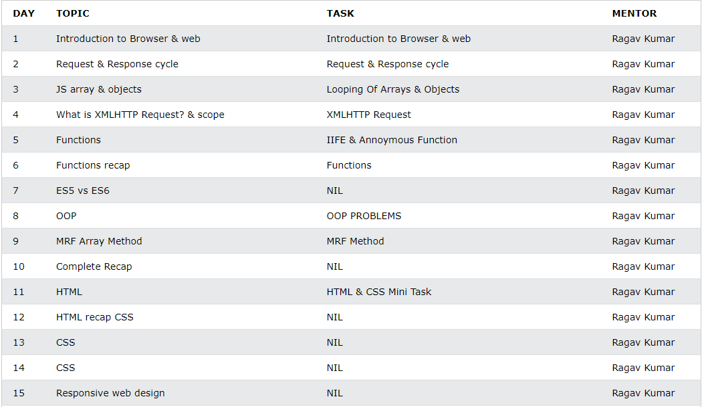
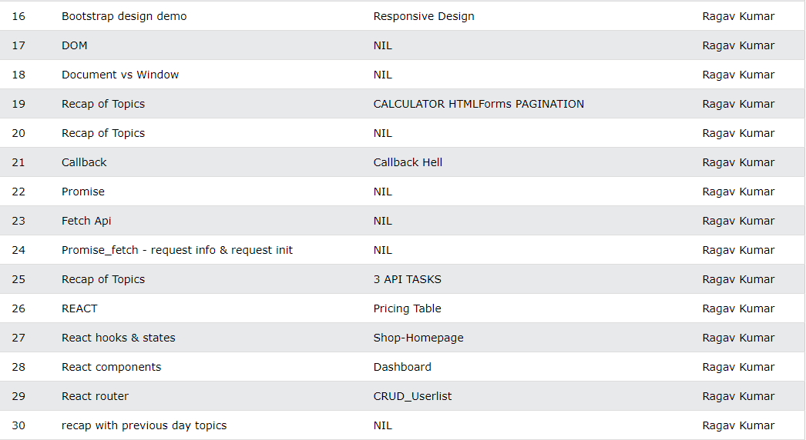
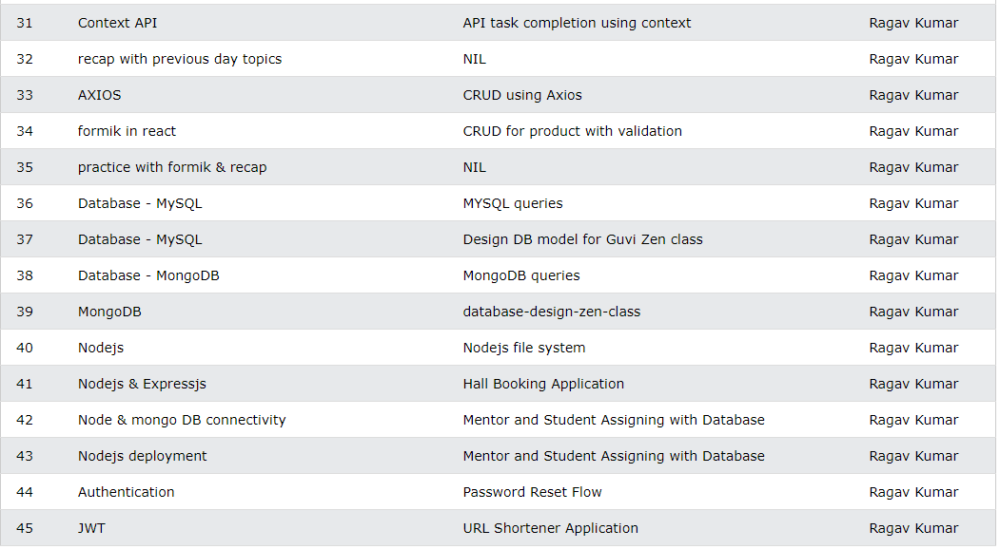

CREATE TABLE ZEN_CLASS(
DAY INTEGER,
TOPIC TEXT,
TASK TEXT);

ALTER TABLE ZEN_CLASS
ADD MENTOR TEXT DEFAULT "Ragav Kumar";

INSERT INTO ZEN_CLASS	
(DAY,CLASS_TOPIC,TASK)
VALUES(1,"Introduction to Browser & web","Introduction to Browser & web"),
(2,"Request & Response cycle","Request & Response cycle"),
(3,"JS array & objects","Looping Of Arrays & Objects"),
(4,"What is XMLHTTP Request? & scope","XMLHTTP Request"),
(5,"Functions","IIFE & Annoymous Function"),
(6,"Functions recap","Functions"),
(7,"ES5 vs ES6","NIL"),
(8,"OOP","OOP PROBLEMS"),
(9,"MRF Array Method","MRF Method"),
(10,"Complete Recap","NIL"),
(11,"HTML","HTML & CSS Mini Task"),
(12,"HTML recap CSS","NIL"),
(13,"CSS","NIL"),
(14,"CSS","NIL"),
(15,"Responsive web design","NIL"),
(16,"Bootstrap design demo","Responsive Design"),
(17,"DOM","NIL"),
(18,"Document vs Window","NIL"),
(19,"Recap of Topics","CALCULATOR HTMLForms PAGINATION"),
(20,"Recap of Topics","NIL"),
(21,"Callback","Callback Hell"),
(22,"Promise","NIL"),
(23,"Fetch Api","NIL"),
(24,"Promise_fetch - request info & request init","NIL"),
(25,"Recap of Topics","3 API TASKS"),
(26,"REACT","Pricing Table"),
(27,"React hooks & states","Shop-Homepage"),
(28,"React components","Dashboard"),
(29,"React router","CRUD_Userlist"),
(30,"recap with previous day topics","NIL"),
(31,"Context API","API task completion using context"),
(32,"recap with previous day topics","NIL"),
(33,"AXIOS","CRUD using Axios"),
(34,"formik in react","CRUD for product with validation"),
(35,"practice with formik & recap","NIL"),
(36,"Database - MySQL","MYSQL queries"),
(37,"Database - MySQL","Design DB model for Guvi Zen class"),
(38,"Database - MongoDB","MongoDB queries"),
(39,"MongoDB","database-design-zen-class"),
(40,"Nodejs","Nodejs file system"),
(41,"Nodejs & Expressjs","Hall Booking Application"),
(42,"Node & mongo DB connectivity","Mentor and Student Assigning with Database"),
(43,"Nodejs deployment","Mentor and Student Assigning with Database"),
(44,"Authentication","Password Reset Flow"),
(45,"JWT","URL Shortener Application");

</img>
</img>
</img>

